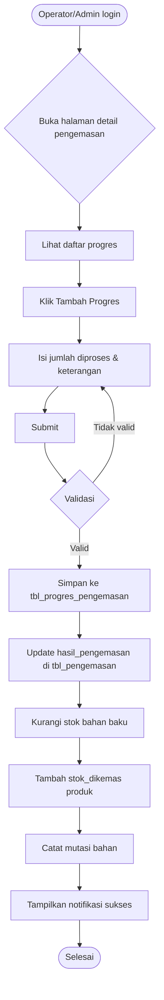
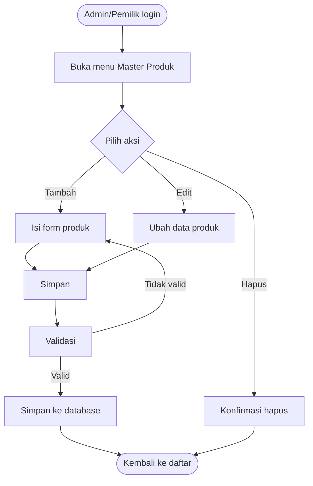
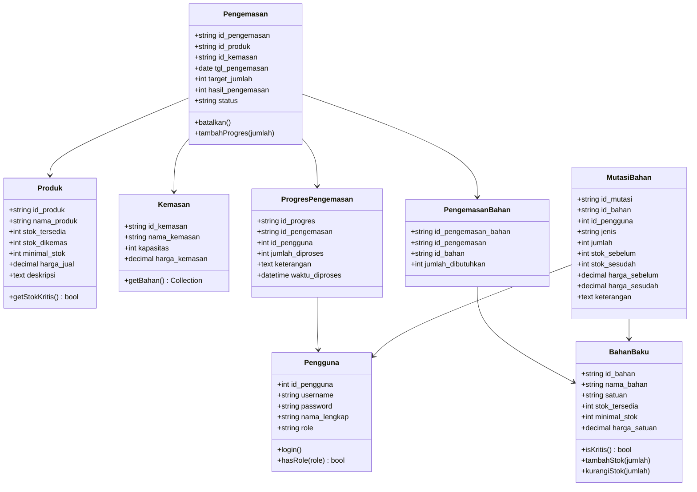
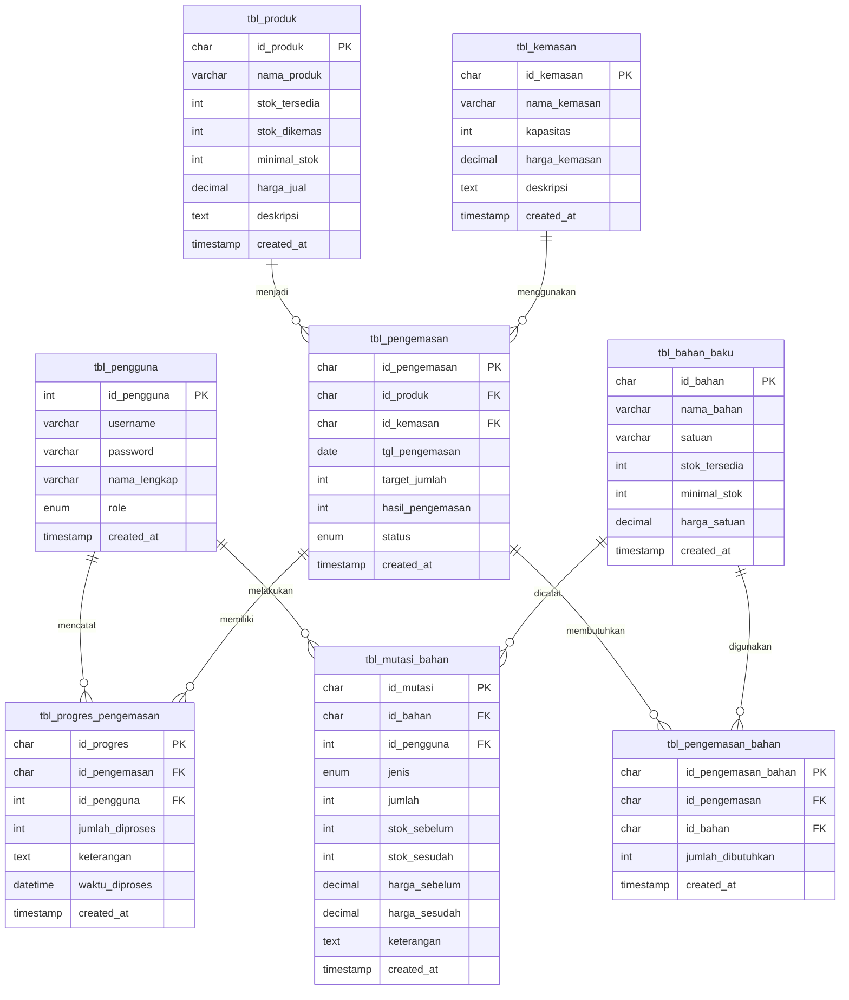
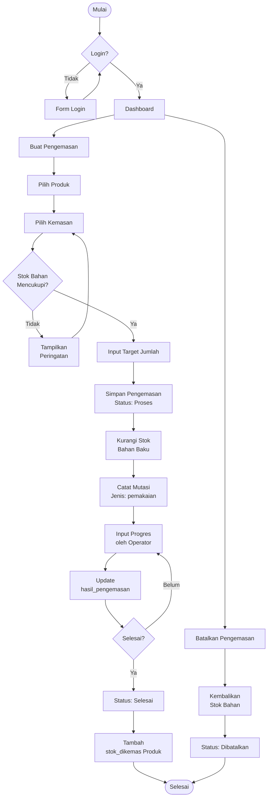

# KemasIn

**Sistem Informasi Manajemen Pengemasan** — Aplikasi berbasis web untuk mengelola pengemasan, stok bahan baku, dan stok produk jadi pada UMKM.

## Daftar Isi

- [Pendahuluan](#pendahuluan)
- [Teknologi](#teknologi)
- [Fitur](#fitur)
- [Role & Hak Akses](#role--hak-akses)
- [Struktur Database](#struktur-database)
- [Arsitektur Aplikasi](#arsitektur-aplikasi)
- [Cara Instalasi](#cara-instalasi)
- [Use Case Diagram](#use-case-diagram)
- [Activity Diagram](#activity-diagram)
- [Class Diagram](#class-diagram)
- [Entity Relationship Diagram](#entity-relationship-diagram)
- [Flowchart](#flowchart)
- [Penjabaran Tabel](#penjabaran-tabel)

---

## Pendahuluan

KemasIn dikembangkan menggunakan pendekatan **Rational Unified Process (RUP)** yang terdiri dari 4 fase:

1. **Inception** — Identifikasi kebutuhan sistem, analisis aktor dan use case
2. **Elaboration** — Perancangan arsitektur, class diagram, ERD, dan basis data
3. **Construction** — Implementasi kode (Laravel + MySQL) dan pengujian
4. **Transition** — Deployment dan pelatihan pengguna

### Tujuan Sistem

- Mendata produk dan kemasan yang tersedia
- Mencatat proses pengemasan dari awal hingga selesai
- Memantau stok bahan baku dan produk jadi
- Menghasilkan laporan pengemasan dan mutasi bahan baku
- Mendukung tiga level pengguna: Admin, Operator, Pemilik

---

## Teknologi

| Komponen           | Teknologi                           |
| ------------------ | ----------------------------------- |
| Backend            | PHP 8.3, Laravel 13                 |
| Frontend           | Bootstrap 5.3, jQuery, Chart.js     |
| Database           | MySQL / MariaDB                     |
| PDF                | barryvdh/laravel-dompdf             |
| CSS                | Font Awesome 6, Custom CSS          |
| Auth               | Session-based (manual, tanpa Breeze) |

---

## Fitur

- **Autentikasi** — Login/Logout dengan username & password
- **Dashboard** — KPI (stok belum dikemas, stok dikemas, bahan kritis, produk hampir habis), grafik pengemasan 7 hari, ringkasan bulanan
- **Master Produk** — CRUD produk
- **Bahan Baku** — CRUD + tambah stok (dengan mutasi otomatis)
- **Kemasan** — CRUD dengan relasi bahan baku (resep)
- **Pengemasan** — CRUD, input progres, batalkan, tracking hasil
- **Stok Produk** — Lihat stok terkini produk (belum dikemas vs sudah dikemas)
- **Stok Bahan Baku** — Lihat stok bahan baku terkini
- **Riwayat Pengemasan** — Log progres pengemasan
- **Riwayat Mutasi Bahan** — Log semua perubahan stok bahan
- **Laporan** — Filter tanggal, tampil tabel, export CSV & PDF
- **Kelola Pengguna** — CRUD user internal (admin, operator, pemilik)
- **Role Middleware** — `admin` bisa akses pengemasan CRUD, `admin+pemilik` untuk master & laporan

---

## Role & Hak Akses

| Role      | Akses                                                              |
| --------- | ------------------------------------------------------------------ |
| Operator  | Dashboard, Pengemasan (lihat & progres), Stok, Riwayat             |
| Admin     | Semua fitur (termasuk CRUD pengemasan, master, laporan, pengguna)  |
| Pemilik   | Master produk, bahan, kemasan, pengguna, laporan (tanpa CRUD pengemasan) |

---

## Struktur Database

### 1. `tbl_produk`

| Kolom              | Tipe          | Keterangan                           |
| ------------------ | ------------- | ------------------------------------ |
| id_produk          | int(11) PK    | Auto Increment                       |
| nama_produk        | varchar(100)  | Nama produk                          |
| stok_tersedia      | int(11)       | Stok belum dikemas                   |
| stok_sudah_dikemas | int(11)       | Stok sudah dikemas                   |
| stok_minimum       | int(11)       | Ambang batas minimal stok            |
| harga_produk       | decimal(12,2) | Harga jual per unit                  |
| keterangan         | text          | Deskripsi produk (nullable)          |
| created_at         | timestamp     | -                                    |
| updated_at         | timestamp     | -                                    |

### 2. `tbl_kemasan`

| Kolom         | Tipe          | Keterangan                      |
| ------------- | ------------- | ------------------------------- |
| id_kemasan    | int(11) PK    | Auto Increment                  |
| nama_kemasan  | varchar(100)  | Nama jenis kemasan              |
| ukuran        | varchar(50)   | Ukuran kemasan                  |
| harga_kemasan | decimal(12,2) | Harga satuan kemasan            |
| created_at    | timestamp     | -                               |
| updated_at    | timestamp     | -                               |

### 2b. `tbl_kemasan_bahan` (resep kemasan)

| Kolom            | Tipe          | Keterangan                      |
| ---------------- | ------------- | ------------------------------- |
| id_kemasan_bahan | int(11) PK    | Auto Increment                  |
| id_kemasan       | int(11) FK    | Relasi ke tbl_kemasan           |
| id_bahan         | int(11) FK    | Relasi ke tbl_bahan_baku        |
| jumlah_per_unit  | decimal(10,2) | Jumlah bahan per unit kemasan   |

### 3. `tbl_bahan_baku`

| Kolom            | Tipe          | Keterangan                        |
| ---------------- | ------------- | --------------------------------- |
| id_bahan         | int(11) PK    | Auto Increment                    |
| nama_bahan       | varchar(100)  | Nama bahan baku                   |
| satuan           | varchar(20)   | Satuan (kg, pcs, liter, dll)      |
| stok_tersedia    | decimal(10,2) | Stok saat ini                     |
| stok_minimum     | decimal(10,2) | Ambang batas minimal              |
| harga_per_satuan | decimal(12,2) | Harga per satuan                  |
| keterangan       | text          | Catatan (nullable)                |
| created_at       | timestamp     | -                                 |
| updated_at       | timestamp     | -                                 |

### 4. `tbl_pengemasan`

| Kolom                  | Tipe          | Keterangan                                |
| ---------------------- | ------------- | ----------------------------------------- |
| id_pengemasan          | int(11) PK    | Auto Increment                            |
| id_produk              | int(11) FK    | Relasi ke tbl_produk                      |
| id_kemasan             | int(11) FK    | Relasi ke tbl_kemasan                     |
| id_produksi            | int(11) FK    | Relasi ke tbl_produksi (nullable)         |
| tgl_pengemasan         | date          | Tanggal pelaksanaan                       |
| target_jumlah          | int(11)       | Target jumlah pengemasan                  |
| hasil_pengemasan       | int(11)       | Hasil akhir (update dari progres)         |
| expired_date           | date          | Tanggal kadaluarsa produk                 |
| id_pengguna            | int(11) FK    | Pembuat/penanggung jawab                  |
| id_operator_ditugaskan | int(11) FK    | Operator ditugaskan (nullable)            |
| status                 | varchar       | `direncanakan`, `proses`, `selesai`, `dibatalkan` |
| created_at             | timestamp     | -                                         |
| updated_at             | timestamp     | -                                         |

### 5. `tbl_pengemasan_bahan`

| Kolom               | Tipe          | Keterangan                         |
| ------------------- | ------------- | ---------------------------------- |
| id_pengemasan_bahan | int(11) PK    | Auto Increment                     |
| id_pengemasan       | int(11) FK    | Relasi ke tbl_pengemasan           |
| id_bahan            | int(11) FK    | Relasi ke tbl_bahan_baku           |
| jumlah_per_unit     | decimal(10,2) | Kebutuhan bahan per unit           |
| total_terealisasi   | decimal(10,2) | Total realisasi pemakaian          |

### 5b. `tbl_pengemasan_operator` (many-to-many)

| Kolom                  | Tipe        | Keterangan                        |
| ---------------------- | ----------- | --------------------------------- |
| id_pengemasan_operator | int(11) PK  | Auto Increment                    |
| id_pengemasan          | int(11)     | Relasi ke tbl_pengemasan          |
| id_pengguna            | int(11)     | Relasi ke tbl_pengguna (operator) |

### 6. `tbl_pengemasan_progres`

| Kolom          | Tipe        | Keterangan                          |
| -------------- | ----------- | ----------------------------------- |
| id_progres     | int(11) PK  | Auto Increment                      |
| id_pengemasan  | int(11) FK  | Relasi ke tbl_pengemasan            |
| id_pengguna    | int(11) FK  | Relasi ke tbl_pengguna              |
| jumlah_dikemas | int(11)     | Jumlah yang diproses                |
| keterangan     | text        | Catatan progres (nullable)          |
| waktu_diproses | datetime    | Waktu input progres (nullable)      |

### 7. `tbl_mutasi_bahan`

| Kolom         | Tipe          | Keterangan                                |
| ------------- | ------------- | ----------------------------------------- |
| id_mutasi     | int(11) PK    | Auto Increment                            |
| id_bahan      | int(11) FK    | Relasi ke tbl_bahan_baku                  |
| jenis         | varchar(30)   | `pemakaian`, `penambahan`, `bahan_baru`, `penyesuaian` |
| jumlah        | decimal(10,2) | Jumlah perubahan                          |
| stok_sebelum  | decimal(10,2) | Stok sebelum perubahan                    |
| stok_sesudah  | decimal(10,2) | Stok sesudah perubahan                    |
| harga_sebelum | decimal(12,2) | Harga satuan sebelum (nullable)           |
| harga_sesudah | decimal(12,2) | Harga satuan sesudah (nullable)           |
| keterangan    | text          | Catatan mutasi (nullable)                 |
| id_pengguna   | int(11)       | Relasi ke tbl_pengguna (nullable)         |
| created_at    | datetime      | Waktu mutasi (manual)                     |

### 8. `tbl_pengguna`

| Kolom         | Tipe          | Keterangan                      |
| ------------- | ------------- | ------------------------------- |
| id_pengguna   | int(11) PK    | Auto Increment                  |
| username      | varchar(50)   | Username login (unique)         |
| password      | varchar(255)  | Hash bcrypt                     |
| nama_lengkap  | varchar(100)  | Nama lengkap pengguna           |
| role          | enum          | `admin`, `operator`, `pemilik`  |
| created_at    | datetime      | (nullable)                      |
| updated_at    | datetime      | (nullable)                      |

---

## Arsitektur Aplikasi

### Struktur Direktori

```
app/
├── Http/
│   ├── Controllers/
│   │   ├── Auth/LoginController.php
│   │   ├── DashboardController.php
│   │   ├── BahanBakuController.php
│   │   ├── KemasanController.php
│   │   ├── PengemasanController.php
│   │   ├── ProdukController.php
│   │   ├── KelolaPenggunaController.php
│   │   ├── StokProdukController.php
│   │   ├── LaporanController.php
│   │   └── HistoryController.php
│   ├── Middleware/
│   │   └── CheckRole.php
│   └── Kernel.php (middleware registration)
├── Models/
│   ├── Pengguna.php
│   ├── Produk.php
│   ├── Kemasan.php
│   ├── BahanBaku.php
│   ├── Pengemasan.php
│   ├── PengemasanBahan.php
│   ├── ProgresPengemasan.php
│   └── MutasiBahan.php
database/
└── migrations/ (8 file migrasi)
routes/
└── web.php (semua route)
resources/
└── views/
    ├── layouts/ (app.blade.php, sidebar.blade.php)
    ├── auth/ (login.blade.php)
    ├── dashboard/ (index.blade.php)
    ├── produk/ (index, create, edit)
    ├── bahan-baku/ (index, create, edit, tambah-stok)
    ├── kemasan/ (index, create, edit)
    ├── pengemasan/ (index, create, edit, show)
    ├── stok/ (index, bahan-baku)
    ├── history/ (pengemasan, bahan-baku)
    ├── laporan/ (index, pengemasan, bahan-baku, pdf-pengemasan)
    └── pengguna/ (index, create, edit)
```

### Routing

Semua route didefinisikan di `routes/web.php`:

- **Guest**: Login
- **Middleware `auth`**: Dashboard, Pengemasan (view & progres), Stok, Riwayat, AJAX
- **Middleware `auth` + `role:admin`**: CRUD Pengemasan (create, edit, delete, batalkan)
- **Middleware `auth` + `role:admin,pemilik`**: Master (produk, bahan, kemasan, pengguna), Laporan (view, export CSV, PDF)

### Autentikasi

Login manual via `LoginController` — tanpa Laravel Breeze/Jetstream. Session-based, password di-hash bcrypt. Model `Pengguna` mengimplementasikan `Authenticatable`.

---

## Cara Instalasi

> **Peringatan:** Pastikan environment Anda sudah menggunakan versi terbaru sebelum menjalankan proyek ini:
> - PHP `>= 8.3` (direkomendasikan PHP 8.3.x terbaru)
> - Composer `>= 2.7`
> - Node.js `>= 20` & NPM `>= 10`
> - Database MySQL `>= 8.0` atau MariaDB `>= 10.6`
> - Ekstensi PHP: `BCMath, Ctype, Fileinfo, JSON, Mbstring, OpenSSL, PDO, Tokenizer, XML, cURL, GD`
>
> Jika versi Anda di bawah ketentuan di atas, kemungkinan akan muncul error saat instalasi.

```bash
# 1. Clone repositori
git clone <repo-url> kemasan-umkm
cd kemasan-umkm

# 2. Install dependencies
composer install
npm install && npm run build

# 3. Konfigurasi environment
cp .env.example .env
# Edit .env: DB_DATABASE, DB_USERNAME, DB_PASSWORD

# 4. Generate key
php artisan key:generate

# 5. Migrasi & seed
php artisan migrate --seed

# 6. Jalankan
php artisan serve
```

Default user seeder:
| Username  | Password    | Role    |
| --------- | ----------- | ------- |
| admin     | admin123    | admin   |
| operator  | operator123 | operator|
| pemilik   | pemilik123  | pemilik |

---

## Use Case Diagram

```mermaid
graph TD
    subgraph "Sistem Informasi Kemasan UMKM"
        subgraph "Autentikasi"
            A1(Login)
            A2(Logout)
            A3(Validasi Kredensial)
        end

        subgraph "Dashboard"
            B1(Lihat Dashboard)
        end

        subgraph "Master Data"
            C1(Kelola Produk)
            C2(Kelola Bahan Baku)
            C3(Kelola Kemasan)
            C4(Tambah Stok Bahan)
        end

        subgraph "Pengemasan"
            D1(Kelola Pengemasan)
            D2(Input Progres)
            D3(Batalkan Pengemasan)
            D4(Cek Stok Bahan)
        end

        subgraph "Monitoring"
            E1(Lihat Stok)
            E2(Lihat Riwayat)
        end

        subgraph "Laporan & Pengguna"
            F1(Kelola Laporan)
            F2(Export Laporan)
            F3(Filter Data)
            F4(Kelola Pengguna)
        end
    end

    A1 -.->|<<include>>| A3
    C2 -.->|<<extend>>| C4
    D1 -.->|<<extend>>| D2
    D1 -.->|<<extend>>| D3
    D1 -.->|<<include>>| D4
    F1 -.->|<<extend>>| F2
    F1 -.->|<<include>>| F3

    Actor1([Admin]) --- A1
    Actor1 --- A2
    Actor1 --- B1
    Actor1 --- C1
    Actor1 --- C2
    Actor1 --- C3
    Actor1 --- D1
    Actor1 --- E1
    Actor1 --- E2
    Actor1 --- F1
    Actor1 --- F4

    Actor2([Operator]) --- A1
    Actor2 --- A2
    Actor2 --- B1
    Actor2 --- D2
    Actor2 --- E1
    Actor2 --- E2

    Actor3([Pemilik]) --- A1
    Actor3 --- A2
    Actor3 --- B1
    Actor3 --- C1
    Actor3 --- C2
    Actor3 --- C3
    Actor3 --- E1
    Actor3 --- E2
    Actor3 --- F1
    Actor3 --- F4
```



---

## Activity Diagram

### Activity Diagram — Input Progres Pengemasan



### Activity Diagram — CRUD Produk



---

## Class Diagram



---

## Entity Relationship Diagram



---

## Flowchart

### Flowchart — Alur Pengemasan



---

## Penjabaran Tabel

### `tbl_produk`

Menyimpan data master produk (barang jadi). Memiliki dua jenis stok: `stok_tersedia` (belum dikemas) dan `stok_sudah_dikemas` (sudah dikemas). Saat progres pengemasan dicatat, `stok_tersedia` akan berkurang dan `stok_sudah_dikemas` bertambah. Kolom `stok_minimum` digunakan untuk menandai produk kritis di dashboard.

### `tbl_kemasan`

Menyimpan data master kemasan dengan `ukuran` (misal: 500gr, 1kg). Relasi ke bahan baku dijembatani oleh `tbl_kemasan_bahan` yang berisi resep (`jumlah_per_unit`) untuk setiap jenis kemasan.

### `tbl_bahan_baku`

Menyimpan data bahan baku dengan stok (desimal) dan harga per satuan. Setiap perubahan stok dicatat di `tbl_mutasi_bahan`. Kolom `stok_minimum` digunakan untuk menandai bahan kritis.

### `tbl_pengemasan`

Entitas utama proses pengemasan. Mencatat produk, kemasan, target, hasil, tanggal kadaluarsa, penanggung jawab, dan status. Status: `direncanakan` (baru dibuat), `proses` (sedang berjalan), `selesai` (target tercapai), `dibatalkan` (stok bahan dikembalikan). Operator dapat ditugaskan melalui relasi many-to-many di `tbl_pengemasan_operator`.

### `tbl_pengemasan_bahan` & `tbl_kemasan_bahan`

Dua tabel berbeda untuk kebutuhan bahan: `tbl_kemasan_bahan` menyimpan resep standar (jumlah bahan per unit kemasan), sedangkan `tbl_pengemasan_bahan` mencatat realisasi pemakaian bahan untuk setiap batch pengemasan tertentu (dengan kolom `total_terealisasi`).

### `tbl_pengemasan_progres`

Mencatat input progres oleh operator. Setiap kali operator menambahkan progres, `jumlah_dikemas` diakumulasi ke `hasil_pengemasan` di tabel pengemasan. Tidak memiliki timestamps otomatis — menggunakan `waktu_diproses` manual.

### `tbl_mutasi_bahan`

Log/snapshot perubahan stok bahan baku. Menyimpan stok dan harga sebelum/sesudah. Jenis mutasi: `pemakaian` (saat pengemasan), `penambahan` (tambah stok manual), `bahan_baru` (saat create bahan), `penyesuaian` (koreksi stok). Kolom `created_at` diisi manual (tanpa timestamps otomatis).

### `tbl_pengguna`

Tabel user internal sistem. Login menggunakan username + password (bcrypt). Role menentukan akses menu. Implementasi `Authenticatable` dari Laravel untuk session management.

---

## Lisensi

Hak cipta © 2026. Digunakan untuk keperluan tugas mata kuliah Analisis Proses Bisnis / RPL.
